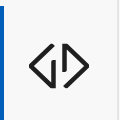
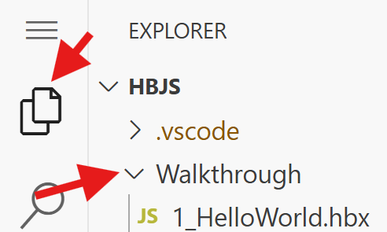
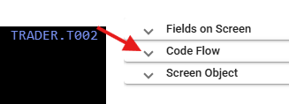
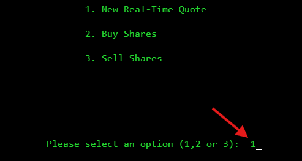
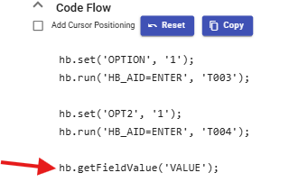

# HB.js Workshop 

This workshop demonstrates how to create a web service that orchestrates multiple CICS transactions to create a business-process oriented API.

**Note:** To view this document with proper formatting and images in VS Code, right-click **WorkshopScenario.md** in the file explorer and select **Open Preview**, or click the **Open Preview to the Side** icon in the top-right corner of the editor.

Instructions are provided below to access your workshop environment. Please notify the instructor if you have questions.

## Getting Started

### Credentials
* **User Number:** Provided on your physical handout (example: 01, 02).
* **USERID:** CUSTO[Your Number]
* **Password:** CUSTO[Your Number]

### External Links
Use the link corresponding to your assigned session. Replace **{fileName}** in the URL with your renamed script name to view results.

* **Session 1:** https://external-943025290693663.proxy.sn.ws.broadcom.com/hbscript/{fileName}
* **Session 2:** https://external-632454778799570.proxy.sn.ws.broadcom.com/hbscript/{fileName}

**Example:** If your UserID is CUSTO01 and you are working on Scenario 1, your final URL will look like: 
`https://.../hbscript/CUSTO01_HelloWorld`

**Technical Documentation:** https://techdocs.broadcom.com/us/en/ca-mainframe-software/devops/hostbridge-javascript-engine/8-0.html

---

## Environment Configuration

1. Click on the **HB.js Icon** in the VS Code Activity Bar (Left Side Panel).


2. Expand **Demo & Training3** using the arrows.
3. Enter your UserID and Password in the pop-up box at the top of the screen when prompted. 
4. Right-click on **hbscript** and select **Set Default Repository**.


5. Verify your configuration shows three check marks, specifically on the final **hbscript** entry.


---

## Scenario 1: Hello World API

1. Navigate to the **Walkthrough** folder in the Explorer tab.


2. Right-click **1_HelloWorld.hbx** and select **Rename**. 
3. Change the name to **[USERID]_HelloWorld.hbx** (Example: CUSTO01_HelloWorld.hbx).
4. Open the file and follow the instructions provided in the code comments.
5. Right-click inside the code editor and select **HB.js Commands > Make**.
6. Access your session link in a browser to verify the output.

### Scenario 1 Key Takeaways: 

**HB.js Primitives:** 
* **Make:** Compiles the script and stores the output on the host. The script will only be placed on the host after a clean compile. 
* **Put:** Stores the source code on the mainframe without compiling it. 
* **Run:** Compiles and executes the script without storing it. 

**Leveraging HB.js Primitives in VS Code:** * Right-click on your file > HB.js Commands > Make/Put/Run
* Alternatively, each command has a connected hot key: 
    * Windows: Alt+X then M, P, or R
    * Mac: Option+X then M, P, or R

<div style="text-align: center;"> 
    
</div>

---

## Scenario 2: Code Flow

1. Navigate to **Walkthrough > 2_StartTrader.hbx**.
2. Rename the file to **[USERID]_StartTrader.hbx**.
3. Follow the instructions inside the file to use Application Explorer and Code Flow.

**Accessing the Application Explorer:**


**Entering Starting Transaction:**


**Opening Code Flow:**


4. Locate the input fields on Screen 1 and Screen 2 as shown:



5. Add the fields to the Code Flow:


6. Use the **Make** command to deploy the script. When your output displays an accurate Total Value of Shares Held, you have completed the exercise.

### Scenario 2 Key Takeaways: 

* **Application Explorer:** Used to identify fields within CICS screens via double-click.
* **Code Flow:** Generates navigation logic automatically based on recorded steps.
* **Field Names:** Values like VALUE and HELD are the field names assigned when the original application was written. This method retrieves values via field-value pairs rather than coordinate-based screen scraping.

---

## Scenario 3: Debugging Intro - BMS Maps

1. Navigate to **Walkthrough > 3_getQuote.hbx**.
2. Rename the file to **[USERID]_getQuote.hbx**.
3. Follow the instructions inside the file to identify correct screen navigation.
4. Verify the file correctly outputs two different companies as described.

### Scenario 3 Key Takeaways: 

* **BMS Map Names:** These can be used to identify specific screens and debug script navigation. You can find the current map name in the **top-right corner** of the Application Explorer.
* **Logic Requirements:** HB.js scripts must follow the logic of the underlying application. If a manual process requires pressing PF3 twice, the script must perform those same steps.

---

## Scenario 4: HB.js Best Practices

1. Navigate to **Walkthrough > 4_getAllQuotes.hbx**.
2. Rename the file to **[USERID]_getAllQuotes.hbx**.
3. Follow the instructions to output data for all four companies.

### Scenario 4 Key Takeaways: 

* **Modular Coding:** Separate coding sections into specific function calls based on logic.
* **Response Variables:** Use a dedicated response variable to consolidate your outputs. 
* **Session Termination:** When navigating 3270 screens, ensure the code terminates the session cleanly:
    ```js    
    hb.run('hb_aid=pf12&hb_delete_session=1');
    ```
* **Tech Docs:** Use the documentation link at the top of this document or within the script for syntax reference.

---

## Scenario 5: Query String Input

1. Navigate to **Walkthrough > 5_getSelectedQuotes.hbx**.
2. Rename the file to **[USERID]_getSelectedQuotes.hbx**.
3. Follow the instructions inside the file to accept dynamic input from a URL query string.

### Scenario 5 Key Takeaways: 

Use the following syntax to retrieve input from a query string:
```js
// Sample Query String: {fullURL}?companies=1,2,3,4
let companies = HB.request.http.getValue('companies');
let companyArray = companies.split(',');
```
---

### Scenario 6: Nearly Production Ready

1. Navigate to the **Walkthrough** folder and open **6_getQuoteFinal.hbx**.
2. **Rename** the file to **[USERID]_getQuoteFinal.hbx**.
3. Review the code carefully to understand how error handling and performance tracking are implemented via comments.
4. Execute the **Make** command.
5. Access the result via your session link.

**Question:** If your query string is `companies=1,2,3,4`, what is the value of **tranCount** in your script output?

### Scenario 6 Key Takeaways

* **Try-Catch Statements:** Used to implement robust error handling and prevent script crashes.
* **Performance Tracking:** Methods for measuring total script run time and counting transaction executions.
* **Output Flexibility:** Demonstrates how scripts can be configured to return data in either JSON or XML formats.

<div style="text-align: center;"> 
    
</div>

---

### Bonus Content

* **Error Handling:** Attempt to run the service with invalid inputs, such as `companies=X` or `companies=6`. Can you modify the script to handle these inputs gracefully?
* **Weather Integration:** Add a function call to retrieve weather data for your local zip code and include that information in the final response variable.
