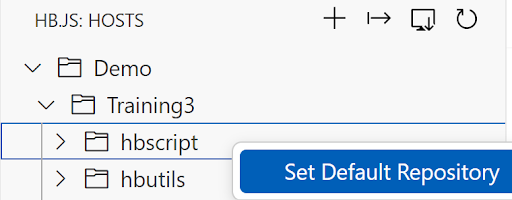
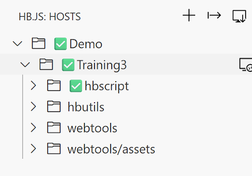
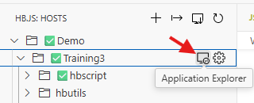
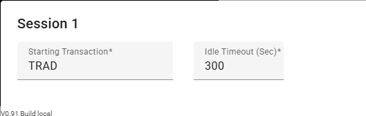
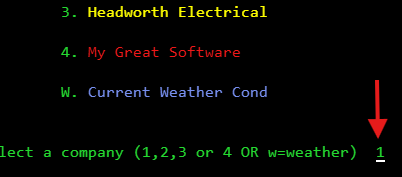
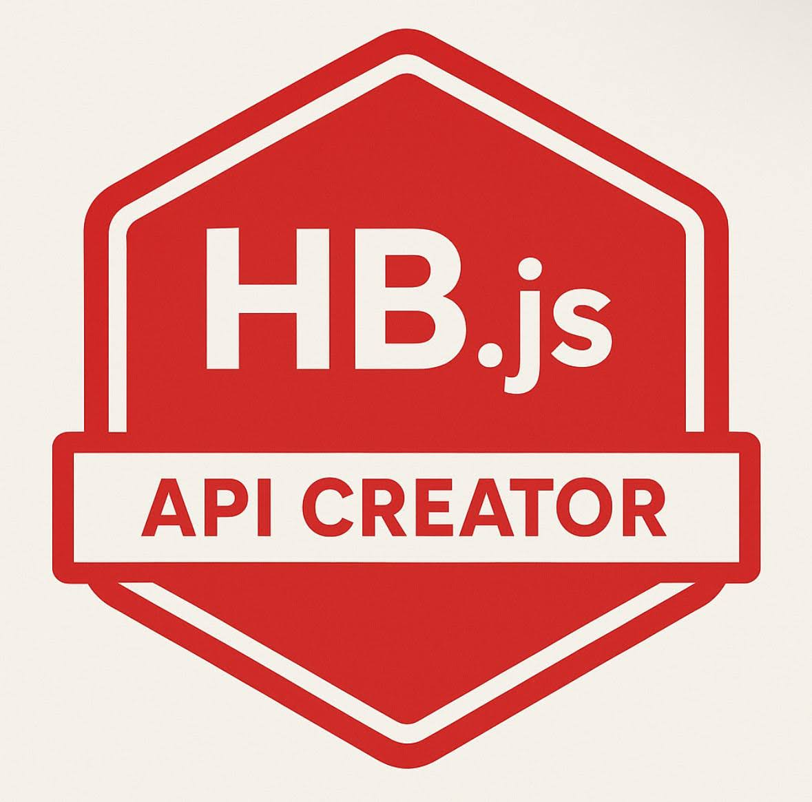

# HB.js Testing Workshop 

In this workshop you will create a web service that tests multiple CICS transactions, creating a test API for your business-process.

Reference the provided instructions to access your workshop evironment. Let us know if you have any questions.

## Getting Started:

##: Provided on a piece of paper

USERID: CUSTO##

Password: CUSTO##

External Link: 
https://external-943025290693663.proxy.sn.ws.broadcom.com/hbscript/{fileName}

TechDocs: https://techdocs.broadcom.com/us/en/ca-mainframe-software/devops/hostbridge-javascript-engine/8-0.html

## Configuration Screenshots:

HB.js Icon (Left - Side Panel)

Right - Click > Set Default Repository 

Configuration is Correct (three check marks, final on hbscript)

## Configure:
1. Click on the HB.js icon
2. Expand Demo & Training3 (using the arrows)
3. Enter your user ID and password if prompted (pop-up box, top middle of screen) 
4. Right - Click on hbscript > Set Default Repository

## Scenario Screen Shots for Reference: 

### Scenario #1:

Access the Exercises (Left - Panel Explorer tab > Walkthrough)

### Scenario #2:
Accessing the Application Explorer

Entering Starting Transaction

Open Code Flow

Screen 1 Input Field

Screen 2 Input Field 

Added Field to Code Flow

## Scenario #1: Hello World API

Access the first exercise in the Walkthrough folder and follow the instructions inside. 

When your hello world external link contains your chosen output, detailed in the file, you have completed the first exercise and gained your first HB.js badge, congratulations!

 - Original File Name: 1_HelloWorld
 - Rename to fileName: {USERID_HelloWorld}

### Scenario #1 Key Takeaways: 

HB.js Primitives: 

 - Make: Compiles the script and stores the output on the host. The script will only be placed on the host after a clean compile. 
 - Put: Stores the source code on the mainframe without compiling it. 
 - Run: Compiles and executes the script without storing it. 

Leveraging HB.js Primitives in VS Code: 

 - Right - click on your file > HB.js Commands > Make/Put/Run
 - Alternatively each command has a connected hot key: 
    - Windows: Alt+X M/P/R
    - Mac: ⌥+X M/P/R

 
    

## Scenario #2: Code Flow

Access the second exercise in the Walkthrough folder and follow the instructions inside. 

When your codeflow external link outputs an accurate Total Value of Shares Held, detailed in the file, you have completed the second exercise, congratulations!

 - Original File Name: 2_StartTrader
 - Rename to fileName: {USERID_StartTrader}

### Scenario #2 Key Takeaways: 

 - Application Explorer Playback
    - Double click on field 
 - Code Flow 
 - Field names like VALUE and HELD are field names the programmer chose when the trader application was originally written. We are not screen scraping but retrieving values using the field names the programmer chose via field-value pairs. 

## Scenario #3: Test Your Workflow 

Access the third exercise in the Walkthrough folder and follow the instructions inside. 

When your script output matches the output detailed in the file, you have completed the third exercise, congratulations!

 - Original File Name: 3_
 - Rename to fileName: {USERID_StartTrader}

### Scenario #3 Key Takeaways:

 - How to leverage HB.js to perform static tests on your CICS application without screen scraping
 - Static Test Functions
    - screen
    - name
    - value
    - position

## Scenario #4: Dynamic Tests Example
Access the fourth exercise in the Walkthrough folder and follow the instructions inside. 

This script has no coding tasks so review the code and when you are confident you 
understand it, you have completed the fourth exercise, congratulations! 

### Scenario #4 Key Takeaways:

 - How to leverage HB.js to perform a dynamic test on your CICS application without screen scraping