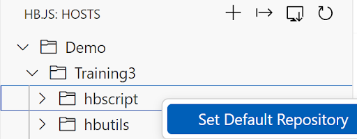
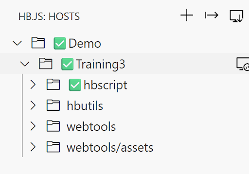

# HB.js Workshop 

In this workshop you will create a web service that orchestrates multiple CICS transactions, creating a business-process oriented API.

Reference the provided instructions [here](./WorkshopAccess.md) to access your workshop evironment. Let us know if you have any questions.

## Getting Started:

##: Provided on a piece of paper

UserID: CUSTO##

Password: CUSTO##

External Link: 
https://external-943025290693663.proxy.sn.ws.broadcom.com/hbscript/{fileName}

TechDocs: https://techdocs.broadcom.com/us/en/ca-mainframe-software/devops/hostbridge-javascript-engine/8-0.html

## Configuration Screenshots:

HB.js Icon (Left - Side Panel)

Right - Click > Set Default Repository 

Configuration is Correct (three check marks, final on hbscript)

## Configure:
1. Click on the HB.js icon
2. Expand Demo & Training3 (using the arrows)
3. Enter your user ID and password if prompted (pop-up box, top middle of screen) 
4. Right - Click on hbscript > Set Default Repository

## Scenario Screen Shots for Reference: 

### Scenario #1:

Access the Exercises (Left - Panel Explorer tab > Walkthrough)

### Scenario #2:
Accessing the Application Explorer

Entering Starting Transaction

Open Code Flow

Screen 1 Input Field

Screen 2 Input Field 

Added Field to Code Flow

## Scenario #1: Hello World API

Access the first exercise in the Walkthrough folder and follow the instructions inside. 
	When your hello world external link contains your chosen output, detailed in the file, you have completed the first exercise and gained your first HB.js badge, congratulations!
Original File Name: 1_HelloWorld
Rename to fileName: {USERID_HelloWorld}

### Scenario #1 Key Takeaways: 

HB.js Primitives: 

 - Make: Compiles the script and stores the output on the host. The script will only be placed on the host after a clean compile. 
 - Put: Stores the source code on the mainframe without compiling it. 
 - Run: Compiles and executes the script without storing it. 

	Leveraging HB.js Primitives in VS Code: 

Right - click on your file > HB.js Commands > Make/Put/Run
Alternatively each command has a connected hot key: 
Windows: Alt+X M/P/R
Mac: ⌥+X M/P/R

HB.js Badge: 

## Scenario #2: Code Flow

Access the second exercise in the Walkthrough folder and follow the instructions inside. 
	When your codeflow external link outputs an accurate Total Value of Shares Held, detailed in the file, you have completed the second exercise, congratulations!
Original File Name: 2_StartTrader
Rename to fileName: {USERID_StartTrader}

### Scenario #2 Key Takeaways: 

Application Explorer
Double click on field 
Code Flow 
Field names like VALUE and HELD are field names the programmer chose when the trader application was originally written. We are not screen scraping but retrieving values using the field names the programmer chose via field-value pairs. 

## Scenario #3: Debugging Intro - BMS Maps

Access the third exercise in the Walkthrough folder and follow the instructions inside. 
	When your file correctly outputs two different companies as described in said file, you have completed the third exercise, congratulations!
Original File Name: 3_getQuote
Rename to fileName: {USERID_getQuote}

### Scenario #3 Key Takeaways: 

How to use BMS Map names to debug your scripts
An introduction to the logic of HB.js scripts. 
HB.js scripts can only follow the logic available within your application. If you have to hit PF3 twice, the script needs to as well. 

## Scenario #4: HB.js Best Practices

Access the fourth exercise in the Walkthrough folder and follow the instructions inside. 
	When your file correctly outputs all four companies as described in said file, you have completed the fourth exercise, congratulations!
Original File Name: 4_getAllQuotes
Rename to fileName: {USERID_getAllQuotes}

### Scenario #4 Key Takeaways: 

Separate your coding sections into function calls by pieces of logic.
Create a response variable for your outputs. 
When writing scripts to navigate 3270 screens, always terminate your code cleanly.
hb.run('hb_aid=pf12&hb_delete_session=1');
Leverage our tech docs as needed! Find the link in the scenario 4 script or at the top of this document. 

## Scenario #5: Query String Input

Access the fifth exercise in the Walkthrough folder and follow the instructions inside. 
	When your file correctly outputs all selected companies as described in said file, you have completed the fifth exercise, congratulations!
Original File Name: 5_getSelectedQuotes
Rename to fileName: {USERID_getSelectedQuotes}

### Scenario #5 Key Takeaways: 

Leverage the following to retrieve input from a query string. The following example is for companies shown in the script file. 
let companies =  HB.request.http.getValue(‘companies’)
companies.split(‘,’)
{fullURL}?companies=1,2,3,4

## Scenario #6: Nearly Production Ready

Congratulations, you have made it to your final scenario. Access the sixth exercise in the Walkthrough folder and carefully read through the code. Notice all the new changes and the comments describing their purpose. When you are ready, “Make” the file, access the result via your external link, and note the output. 
If your companies=’1,2,3,4’, what is your script tranCount?  
When you can answer this question, you have completed the sixth and final exercise and gained your second HB.js badge, congratulations!
Original File Name: 6_getQuoteFinal
Rename to fileName: {USERID_getQuoteFinal}

### Scenario #6 Key Takeaways: 

Try-catch statements
Tracking run time
Error messaging 
Transaction count 
Optional output: JSON or XML

HB.js Badge: 

## Bonus Content!!!
More protections and capabilities could be built into this service.  
Try running the service with companies=X or companies=6. Can you improve this service further???
Try adding in a function call to check the weather in your local zip code. Cleanly add in your output to the response variable. 

